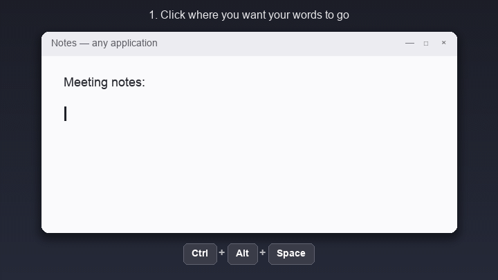

# Speech

Speech is a Windows 10/11 tray app for local speech dictation.
It records your microphone with a global hotkey, transcribes with faster-whisper, optionally cleans the text, and pastes into the focused app.
It transcribes in 99 languages with automatic language detection, and has quick-force hotkeys for English and Spanish.



## How it works

1. Click where you want your words to go, in any app.
2. Press `Ctrl+Alt+Space` to start recording. A floating orb appears near your cursor.
3. Speak, then press `Ctrl+Alt+Space` again or click the red button to stop.
4. Speech transcribes locally and pastes the text right where your cursor was.

Speech remembers which window was active when you started recording and focuses it again before pasting, so the text lands where you were working even if you clicked elsewhere while speaking.

## Works in every app you type in

Speech types wherever your cursor is, so it works with virtually any Windows application.

- Browsers: Chrome, Edge, Firefox, and any web app running in them.
- Messaging: Slack, WhatsApp Desktop, Telegram, Discord, Teams.
- Email: Outlook, Gmail, Thunderbird.
- Notes and documents: Notepad, OneNote, Obsidian, Notion, Word.
- Coding: VS Code, JetBrains IDEs, Cursor, terminals, and coding agents such as Claude Code.

If you can type there, you can dictate there.
Speech pastes into the focused window with `Ctrl+V`, and automatically switches to `Ctrl+Shift+V` for terminal windows.

## Languages

In the default `auto` mode, Speech detects the language you speak and transcribes it in that language, covering the 99 languages of Whisper's multilingual models.
Dedicated hotkeys force English (`Ctrl+Alt+E`) or Spanish (`Ctrl+Alt+S`) for a single dictation when you want to skip detection.
You can also pin the language from the tray menu or with `language_mode` in the settings file.
Accuracy varies by language and model size: `small` is strong for widely spoken languages, and `medium` or `large-v3` improve the less common ones.
Text cleanup preserves the original language and never translates.

## Installation for users

Download the latest Windows installer from this repository's latest release:

```text
https://github.com/andresleecom/speech/releases/latest/download/Speech-Setup.exe
```

Run `Speech-Setup.exe`. The installer is per-user and does not require
administrator privileges. Versioned installers are also attached to each release
as `Speech-Setup-<version>.exe`.

The app checks GitHub Releases for updates once per day by default. When a new
version is available, use the tray menu item `Check for Updates` to confirm,
download, verify, and launch the installer.

## Development setup

Clone the repository.

```powershell
git clone https://github.com/andresleecom/speech.git
cd speech
```

Create a Python 3.11 or 3.12 virtual environment.

```powershell
py -3.12 -m venv .venv
```

Use `py -3.11 -m venv .venv` instead if you want Python 3.11.
Activate the virtual environment.

```powershell
.\.venv\Scripts\Activate.ps1
```

Upgrade pip.

```powershell
python -m pip install --upgrade pip
```

Install the runtime requirements.

```powershell
pip install -r requirements.txt
```

The requirements file installs the local package in editable mode and pulls the
runtime dependencies declared in `pyproject.toml`.

## Run

Start the tray app from the activated virtual environment.

```powershell
python -m winwhisper.main
```

## First Test

Open Notepad.
Press `Ctrl+Alt+Space`.
Say, "Hello this is a test."
Click the floating red recording button or press `Ctrl+Alt+Space` again.
The transcribed text should paste into Notepad.

## Spanish Test

Open Notepad.
Press `Ctrl+Alt+S`.
Say, "Hola este es un mensaje de prueba."
Click the floating red recording button or press `Ctrl+Alt+S` again.
The Spanish transcription should paste into Notepad.

## Hotkeys table

| Action | Default hotkey |
| --- | --- |
| Start or stop recording | `Ctrl+Alt+Space` |
| Start or stop with English for this dictation | `Ctrl+Alt+E` |
| Start or stop with Spanish for this dictation | `Ctrl+Alt+S` |

## Customizing hotkeys

Edit the `hotkeys` object in `%APPDATA%\Speech\settings.json`, then restart Speech.

```json
"hotkeys": {
  "toggle_recording": "<ctrl>+<shift>+<numpad_plus>"
}
```

A combo is zero or more modifiers plus exactly one trigger key.
Supported modifiers are `<ctrl>`, `<alt>`, `<shift>`, and `<cmd>` (the Windows key).
The trigger can be a letter or digit, a function key such as `<f8>`, or a named key such as `<space>`, `<numpad_plus>`, `<numpad_minus>`, `<numpad0>` through `<numpad9>`, `<plus>`, or `<minus>`.
Remove an action from `hotkeys` to leave it without a hotkey.
If a combo is already registered by another application, Speech logs a warning and skips it.

On Spanish and other international layouts, `Ctrl+Alt` is the same key as `AltGr`.
That makes the default `Ctrl+Alt+E` fire when you type `€` with `AltGr+E`, and `Ctrl+Alt+S` when you type `AltGr+S`.
If that gets in your way, rebind those actions to combos without `Ctrl+Alt`, or use a numpad key such as `<ctrl>+<shift>+<numpad_plus>`, which never collides with typing.

## Settings file location and keys

The settings file is `%APPDATA%\Speech\settings.json`.
The app creates the file on first run if it does not exist.

| Key | Default | Description |
| --- | --- | --- |
| `model_size` | `small` | faster-whisper model size. |
| `device` | `cpu` | Inference device such as `cpu` or `cuda`. |
| `compute_type` | `int8` | faster-whisper compute type. |
| `language_mode` | `auto` | Use `auto`, `en`, or `es`. |
| `cleanup_mode` | `basic` | Use `none`, `basic`, or `llm`. |
| `paste_mode` | `auto` | Paste shortcut mode. `auto` uses `Ctrl+Shift+V` for common terminal windows and `Ctrl+V` elsewhere. Older `clipboard_ctrl_v` settings keep the same terminal detection. Use `clipboard_ctrl_shift_v` to force `Ctrl+Shift+V`. |
| `delete_audio_after_transcription` | `true` | Delete temporary WAV files after transcription. |
| `check_for_updates` | `true` | Check GitHub Releases for updates at most once per day. |
| `last_update_check_at` | `null` | Internal timestamp for update throttling. |
| `hotkeys` | See defaults above. | Global hotkey bindings. |

Language and cleanup mode can be changed from the tray menu without a restart.
After editing `hotkeys`, `model_size`, `device`, or `compute_type` in the
settings file, restart Speech for those values to take effect.

## Floating recording button

When recording starts, Speech shows a floating circular recording
orb to the right of the text cursor when Windows exposes it, or near the mouse
cursor as a fallback. The red center button stops recording, and the surrounding
sonar rings pulse while the microphone is live. Drag the orb to move it. After
you stop recording, the orb switches to a transcribing spinner until the text is
ready. The app remembers the active window from the start of recording and tries
to focus it again before pasting, so the text goes back where your cursor was
when dictation began.

On Windows, the overlay uses a native layered window with per-pixel alpha for
smooth circular edges and transparent corners. Tkinter is kept as a fallback for
development and future non-Windows work.

In `auto` paste mode, terminal windows such as Windows Terminal, WezTerm,
Alacritty, mintty, and legacy console hosts receive `Ctrl+Shift+V`. Other
windows receive `Ctrl+V`.

## Model Recommendations

Use `small` on `cpu` with `int8` for the default MVP experience.
Use `medium` if you want better accuracy and can accept slower transcription.
Use `large-v3` if you want the highest accuracy and have enough memory and patience.
Use `cuda` with `float16` or `int8_float16` when you have a supported NVIDIA GPU.

## Privacy

Transcription runs locally by default.
Temporary WAV files are written under `%TEMP%\Speech\`.
Temporary WAV files are deleted after transcription when `delete_audio_after_transcription` is `true`.
LLM cleanup is off by default.
LLM cleanup only runs when `cleanup_mode` is `llm` and `OPENAI_API_KEY` is set.

## Diagnostics

Run diagnostics from the activated virtual environment.

```powershell
python -m winwhisper.diagnostics
```

The diagnostics report includes Python, OS, microphone, model, dependency, API key presence, and temp directory checks.

## Known limitations

Dictation text remains on the clipboard after each paste attempt so you can press
`Ctrl+V` manually if the focused app did not accept the automatic paste.
Previous clipboard content is not preserved in the MVP.

## Troubleshooting

Some antivirus products that intercept TLS, such as Norton, break the first-run model download in two ways.
They set `SSLKEYLOGFILE` to a special device path, which crashes OpenSSL with a "no OPENSSL_Applink" error.
They also re-sign HTTPS traffic with a certificate that Python's default trust store rejects, causing `CERTIFICATE_VERIFY_FAILED`.
The app works around both automatically at startup: it removes an invalid `SSLKEYLOGFILE` value and trusts the Windows certificate store via `truststore`.
If you download models from your own scripts instead, apply the same two workarounds there.

## Packaging and releases

Install development dependencies.

```powershell
pip install -r requirements-dev.txt
```

Install Inno Setup 6, then build the Windows app and installer.

```powershell
.\scripts\build_windows.ps1
```

The build outputs:

- `dist\Speech\Speech.exe`
- `dist\installer\Speech-Setup-<version>.exe`
- `dist\installer\Speech-Setup-<version>.exe.sha256`
- `dist\installer\Speech-Setup.exe`
- `dist\installer\Speech-Setup.exe.sha256`

To publish a release, update the version in `pyproject.toml`, then push a tag
such as `v0.1.0`. The GitHub Actions release workflow builds the installer and
publishes both the stable installer URL and the versioned `.exe` plus `.sha256`
files to GitHub Releases.

The README demo GIF is generated, not screen-recorded.
Regenerate `docs/demo.gif` after visual changes to the overlay.

```powershell
python scripts\make_demo_gif.py
```

## Roadmap

- Windows installer and GitHub Releases auto-update: current target.
- macOS app bundle and signed/notarized installer.
- Linux AppImage or distro packages.
