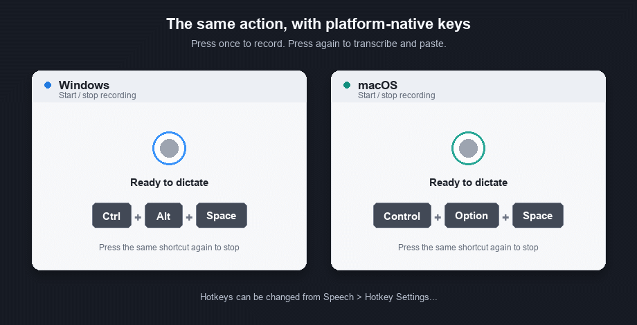
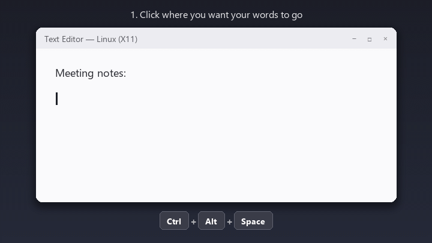

# Speech

[](https://github.com/andresleecom/speech/actions/workflows/ci.yml)
[](https://github.com/andresleecom/speech/actions/workflows/codeql.yml)
[](https://github.com/andresleecom/speech/releases/latest)
[](LICENSE)


Speech is a Windows 10/11, macOS, and Linux tray/menu-bar app for local speech dictation.
It records your microphone with a global hotkey, transcribes with faster-whisper, optionally formats the text, and pastes into the focused app.
It transcribes in 100 languages with automatic language detection and three configurable quick-language actions, defaulting to English and Spanish.



## How it works

1. Click where you want your words to go, in any app.
2. Press the start/stop hotkey: `Ctrl+Alt+Space` on Windows/Linux or `Control+Option+Space` on macOS. A floating orb appears near your cursor.
3. Speak, then press the same combo again or click the red button to stop.
4. Speech transcribes locally and pastes the text right where your cursor was.

Speech remembers which window was active when you started recording and focuses it again before pasting, so the text lands where you were working even if you clicked elsewhere while speaking.

## Works in every app you type in

Speech types wherever your cursor is, so it works with virtually any application that accepts a standard paste shortcut.

- Browsers: Chrome, Edge, Firefox, and any web app running in them.
- Messaging: Slack, WhatsApp Desktop, Telegram, Discord, Teams.
- Email: Outlook, Gmail, Thunderbird.
- Notes and documents: Notepad, OneNote, Obsidian, Notion, Word.
- Coding: VS Code, JetBrains IDEs, Cursor, terminals, and coding agents such as Claude Code.

If you can type there, you can dictate there.
On Windows and Linux, Speech pastes with `Ctrl+V` and automatically switches to `Ctrl+Shift+V` for supported terminal windows. On macOS, it always pastes with `Cmd+V`.

## Languages

In the default `auto` mode, Speech detects the language you speak and transcribes it in that language, covering the 100 language codes supported by its Whisper integration.
Choose **Language > Language Settings...** from the tray/menu-bar icon to type a language name, select any supported language, and pin up to three distinct favorites. The Language menu puts those favorites before the commonly used languages.
Favorite 1 defaults to English and Favorite 2 to Spanish, so `Ctrl+Shift+E` and `Ctrl+Shift+S` keep their existing behavior. Change a favorite to make its quick action force any other supported language for one dictation. Favorite 3 is unpinned, with its hotkey disabled, until you configure both in **Language Settings...** and **Hotkey Settings...**.
You can also set `language_mode` to `auto` or a supported code such as `fr`, `ja`, `ar`, `zh`, or `yue` in the settings file.
Accuracy varies by language and model size: `small` is strong for widely spoken languages, and `medium` or `large-v3` improve the less common ones.
Text cleanup preserves the original language and never translates.

## Microphone

Choose **Microphone** from the tray/menu-bar icon to use **System Default** or select a specific input device. System Default is the safe default and follows the microphone selected by the operating system.

Choose **Test Microphone** to open the floating recording orb for five seconds. Its rings react to the live input level, and Speech reports whether it detected sound. The test never writes audio to disk or transcribes it. Click the red stop control or press a dictation hotkey to stop the test early.

If a selected device is disconnected or cannot be opened, Speech keeps the selection visible as unavailable and tells you to choose **System Default** or another microphone. Check the operating system's microphone permission when no sound is detected.

## Text cleanup

`Cleanup` is the optional step between transcription and pasting. It changes text only; the audio always stays local.

| Mode | What it does | Network use |
| --- | --- | --- |
| `None` | Pastes the transcription exactly as returned by the speech model. Use it when you need the most literal result. | None. |
| `Basic` (default) | Removes leading/trailing and repeated whitespace, removes spaces before punctuation, and capitalizes the first alphabetic character. It does not rewrite or translate your words. | None. |
| `LLM` | Uses your own OpenAI API key to improve punctuation, capitalization, spacing, obvious disfluencies, and spelling from custom vocabulary. It preserves the language, does not translate, and does not add ideas. | The transcript text only, never audio, is sent to OpenAI. |

Choose the mode from the tray/menu-bar icon under **Cleanup**, or set `cleanup_mode` in the settings file. `LLM` needs `OPENAI_API_KEY` in the environment before Speech starts and uses `gpt-4o-mini` by default. If the key is missing, the request fails, or it times out, Speech automatically falls back to `Basic` so dictation can still complete.

For most users, leave `Basic` selected. Choose `None` for verbatim technical notes or commands, and choose `LLM` only when you want more editorial cleanup and are comfortable sending the transcript text to your OpenAI account.

## Platform support

Windows 10/11, macOS, and x86_64 Linux ship as downloadable apps. Linux packages target Ubuntu 22.04 or newer and Debian 12 or newer.
Linux uses X11; Wayland is not supported yet. The test suite runs on all three systems in CI.

macOS notes:

- Global hotkeys need both the Accessibility and Input Monitoring permissions. Enable Speech under System Settings > Privacy & Security > Accessibility and Input Monitoring, then fully quit and reopen the app.
- The default hotkey is `Control+Option+Space`; Option is sometimes labeled Alt on Mac-compatible keyboards. Speech pastes with `Cmd+V` automatically.
- Replacing or deleting an unsigned build can make macOS require permission approval again. If the hotkey stops responding after an update, switch Speech off and back on in both permission lists, then quit and reopen it.
- Automatic in-app updates are Windows-only for now; download new DMGs from Releases.

Linux notes:

- The default hotkey is `Ctrl+Alt+Space`, and Speech pastes with `Ctrl+V` or `Ctrl+Shift+V` in supported terminals.
- X11 is required for global hotkeys, focus restoration, and the floating orb. Wayland is not supported yet.
- The desktop must provide an AppIndicator-compatible system tray. Ubuntu includes one; Debian GNOME users can install `gnome-shell-extension-appindicator` if the icon is missing.
- Automatic in-app updates are Windows-only; download new AppImage or Debian packages from Releases.

## Installation for users

### Windows

Download the latest Windows installer from this repository's latest release:

```text
https://github.com/andresleecom/speech/releases/latest/download/Speech-Setup.exe
```

Run `Speech-Setup.exe`. The installer is per-user and does not require
administrator privileges. Versioned installers are also attached to each release
as `Speech-Setup-<version>.exe`.

The app checks GitHub Releases for updates once per day by default. When a new
version is available, use the tray menu item `Check for Updates` to confirm,
download, verify, and launch the installer.

### macOS

Pick the DMG that matches your Mac's chip (check **Apple menu > About This Mac**):

| Your Mac | Download |
| --- | --- |
| Apple Silicon (M1 and later) | `https://github.com/andresleecom/speech/releases/latest/download/Speech.dmg` |
| Intel | `https://github.com/andresleecom/speech/releases/latest/download/Speech-intel.dmg` |

Downloading the wrong architecture makes macOS refuse to open the app with an "incorrect executable format" or "Launch failed" error.

Then:

1. Open the DMG and drag `Speech.app` into `Applications`.
2. First launch: right-click `Speech.app`, choose `Open`, and confirm (the app is not yet code-signed).
3. Enable Speech under System Settings > Privacy & Security > Accessibility and Input Monitoring, then quit Speech (menu bar icon > Exit) and open it again. Input Monitoring lets Speech receive global hotkeys; Accessibility lets it paste into other apps.
4. Allow the Microphone permission on your first recording.

When replacing an older `Speech.app`, repeat step 3 even if Speech already appears enabled. Toggle both permissions off and back on, then relaunch the app. This is especially important while releases are unsigned.

Speech lives in the menu bar (no Dock icon); the icon color shows the recording state.

### Linux (x86_64, X11; Ubuntu 22.04+ or Debian 12+)

Choose either package from the latest release:

| Format | Download |
| --- | --- |
| AppImage | `https://github.com/andresleecom/speech/releases/latest/download/Speech.AppImage` |
| Debian/Ubuntu | `https://github.com/andresleecom/speech/releases/latest/download/Speech.deb` |

Install FUSE support, then run the AppImage directly:

```bash
sudo apt install fuse3 libfuse2
chmod +x Speech.AppImage
./Speech.AppImage
```

If FUSE mounting is unavailable, use the supported extraction fallback:

```bash
APPIMAGE_EXTRACT_AND_RUN=1 ./Speech.AppImage
```

Or install the Debian package:

```bash
sudo apt install ./Speech.deb
```

Speech runs in the system tray. These packages require an X11 session; Wayland is not supported yet.

## Development setup

Clone the repository on any supported platform.

```bash
git clone https://github.com/andresleecom/speech.git
cd speech
```

Create a Python 3.11 or 3.12 virtual environment.

```powershell
# Windows PowerShell
py -3.12 -m venv .venv
```

```bash
# macOS or Linux
python3.12 -m venv .venv
```

Use the equivalent Python 3.11 command if needed. Activate the virtual environment.

```powershell
# Windows PowerShell
.\.venv\Scripts\Activate.ps1
```

```bash
# macOS or Linux
source .venv/bin/activate
```

On Debian/Ubuntu, install the native build and runtime dependencies before the
Python requirements:

```bash
sudo apt install \
  build-essential \
  curl \
  file \
  gir1.2-ayatanaappindicator3-0.1 \
  gir1.2-gtk-3.0 \
  libcairo2-dev \
  libgirepository1.0-dev \
  libportaudio2 \
  pkg-config \
  python3-dev \
  xclip
```

If the virtual environment uses a non-system Python, install its matching
development-header package as well. Then upgrade pip and install the runtime
requirements.

```bash
python -m pip install --upgrade pip
pip install -r requirements.txt
```

The requirements file installs the local package in editable mode and pulls the
runtime dependencies declared in `pyproject.toml`.

## Run

Start the tray app from the activated virtual environment.

```bash
python -m winwhisper.main
```

## Using Speech on Windows

Open Notepad and click into it.
Press `Ctrl+Alt+Space`.
Say, "Hello this is a test."
Press `Ctrl+Alt+Space` again, or click the floating red recording button.
The transcribed text pastes into Notepad at your cursor.

By default, `Ctrl+Shift+S` starts and stops a Spanish dictation and `Ctrl+Shift+E` does the same for English. Assign different languages to Favorites 1 and 2 in **Language Settings...** to change those quick actions without changing their shortcuts.

## Using Speech on macOS

On a Mac keyboard, Alt is the Option key.

Open Notes and click into a note.
Press `Control+Option+Space`.
Say, "Hello this is a test."
Press `Control+Option+Space` again, or click the floating red recording button.
The transcribed text pastes into Notes at your cursor via `Cmd+V`, sent automatically.

If the hotkey does not respond, enable Speech under System Settings > Privacy & Security > Accessibility and Input Monitoring, then relaunch the app. Input Monitoring lets Speech listen for global hotkeys; Accessibility lets it send the paste keystroke.

## Using Speech on Linux

Start Speech from the application menu, with the `speech` command, or by running the AppImage. Click into an app, press `Ctrl+Alt+Space`, speak, and press the same shortcut again. Speech restores the original X11 window and pastes at the cursor.



## Default hotkeys

| Action | Windows | macOS | Linux |
| --- | --- | --- | --- |
| Start or stop recording | `Ctrl+Alt+Space` | `Control+Option+Space` | `Ctrl+Alt+Space` |
| Start or stop with Favorite 1 (English by default) | `Ctrl+Shift+E` | `Control+Shift+E` | `Ctrl+Shift+E` |
| Start or stop with Favorite 2 (Spanish by default) | `Ctrl+Shift+S` | `Control+Shift+S` | `Ctrl+Shift+S` |
| Start or stop with Favorite 3 | Disabled by default | Disabled by default | Disabled by default |


## Customizing hotkeys

Open the tray menu and choose **Hotkey Settings...**. Select a suggested shortcut or type one, then choose **Save hotkeys**. Speech validates the shortcuts, rejects duplicates, saves them, and applies them immediately without a restart. On Windows, an operating-system registration conflict also leaves the previous working hotkeys in place.

The editor uses platform names: `Win` on Windows is `Command` on macOS, and `Alt` on Windows is `Option` on macOS. Choose **Disabled** to leave an action without a hotkey. Printable keys require a modifier so normal typing cannot start dictation; function keys such as `F8` can be used alone.

Set the languages for the three quick actions in **Language Settings...** first. Favorites cannot use Auto-detect or repeat the same language. The first two actions preserve the saved English and Spanish hotkey entries from previous versions: changing a favorite changes the language it forces, not its existing shortcut. Enable a shortcut for Favorite 3 only after pinning a third language.

The advanced settings file still accepts serialized hotkeys. For example, on Windows:

```json
"hotkeys": {
  "toggle_recording": "<ctrl>+<shift>+<numpad_plus>"
}
```

A combo is zero or more modifiers plus exactly one trigger key.
Supported modifiers are `<ctrl>`, `<alt>`, `<shift>`, and `<cmd>` (`Win` on Windows, `Command` on macOS).
On macOS, triggers can be ASCII letters or digits, `<space>`, `<enter>`, `<tab>`, `<esc>`, `<backspace>`, `<delete>`, `<home>`, `<end>`, `<page_up>`, `<page_down>`, arrow keys, or `<f1>` through `<f20>`. Windows also supports numpad keys, `<plus>`, `<minus>`, and function keys through `<f24>`.
macOS intentionally rejects Option with a letter or number because its meaning changes with the keyboard layout. Prefer Space, a function key, or a shortcut without Option for custom Mac bindings.
Remove an action from `hotkeys` to leave it without a hotkey.
If a combo is already registered by another application, the editor keeps the previous working hotkeys and asks for a different shortcut.

The first two defaults use `Ctrl+Shift` on Windows and `Control+Shift` on macOS, so they do not collide with `AltGr` on international Windows layouts or Option-modified letters on macOS. Existing installations keep their saved shortcuts until you change them in **Hotkey Settings...**. The persisted keys `force_english` and `force_spanish` remain for compatibility; `force_language_3` is the optional third action.

## Settings file location and keys

The settings file is `%APPDATA%\Speech\settings.json` on Windows, `~/Library/Application Support/Speech/settings.json` on macOS, and `$XDG_CONFIG_HOME/speech/settings.json` on Linux (default `~/.config/speech/settings.json`).
The app creates the file on first run if it does not exist.

| Key | Default | Description |
| --- | --- | --- |
| `model_size` | `small` | faster-whisper model size. |
| `device` | `cpu` | Inference device such as `cpu` or `cuda`. |
| `compute_type` | `int8` | faster-whisper compute type. |
| `audio_input_device` | `null` | Use `null` for System Default or a non-negative sound-device index selected from the Microphone menu. |
| `language_mode` | `auto` | Use `auto` or any supported Whisper language code, such as `en`, `es`, `fr`, `ja`, `ar`, `zh`, or `yue`. |
| `language_favorites` | `["en", "es", null]` | Three distinct non-auto language codes for quick actions. Use `null` to leave a slot unpinned. |
| `cleanup_mode` | `basic` | Use `none`, `basic`, or `llm`; see [Text cleanup](#text-cleanup). |
| `paste_mode` | `auto` | On Windows and Linux, `auto` uses `Ctrl+Shift+V` for common terminal windows and `Ctrl+V` elsewhere. On macOS, Speech always sends `Cmd+V`. Older `clipboard_ctrl_v` settings keep the same terminal detection. Use `clipboard_ctrl_shift_v` to force `Ctrl+Shift+V` on Windows/Linux. |
| `delete_audio_after_transcription` | `true` | Delete temporary WAV files after transcription. |
| `check_for_updates` | `true` | On Windows, check GitHub Releases for updates at most once per day. macOS and Linux updates are manual. |
| `last_update_check_at` | `null` | Internal timestamp for update throttling. |
| `hotkeys` | See defaults above. | Global hotkey bindings, including optional `force_language_3`. |
| `custom_vocabulary` | `[]` | Names and terms you use often, transcribed with these exact spellings. |

Language selection, favorites, cleanup mode, and hotkeys can be changed from the tray menu without a restart. Use **Language Settings...** to search the full language list and configure quick-language actions.
After editing `model_size`, `device`, `compute_type`, or `custom_vocabulary` in
the advanced settings file, restart Speech for those values to take effect.

## Custom vocabulary

Whisper guesses unfamiliar names and jargon phonetically, so "README" can come out as "Rhythmi" and product names get mangled.
List the words you use often in `custom_vocabulary` and Speech biases both transcription and LLM cleanup toward those exact spellings.

```json
"custom_vocabulary": ["README", "Claude Code", "winwhisper", "Andres Lee"]
```

Good candidates are product names, people's names, company jargon, and technical terms.
Keep the list short and specific; a few dozen entries work better than hundreds.
Restart Speech after editing it.

## Floating recording button

When recording starts, Speech shows a floating circular recording orb near the text cursor when Windows exposes one, or near the mouse cursor as a fallback and on macOS/Linux. The red center button stops recording, and the surrounding sonar rings pulse while the microphone is live. Drag the orb to move it. After you stop recording, the orb switches to a transcribing spinner until the text is ready. The app remembers the active window from the start of recording and tries to focus it again before pasting, so the text goes back where your cursor was when dictation began.

On Windows and Linux in `auto` paste mode, supported terminal windows receive `Ctrl+Shift+V`; other apps receive `Ctrl+V`. macOS uses `Cmd+V`.

## Model and performance

Use `small` on `cpu` with `int8` for the default MVP experience.
Use `medium` if you want better accuracy and can accept slower transcription.
Use `large-v3` if you want the highest accuracy and have enough memory and patience.
Use `cuda` with `float16` or `int8_float16` when you have a supported NVIDIA GPU. CUDA does not apply to normal macOS builds.

## Security and privacy

Speech is built so you do not have to take anyone's word for it - the code is open and every claim below can be checked in the source.

**Your voice never leaves your machine.**
Recording and transcription run entirely locally with faster-whisper; there is no cloud speech service, no account, and no telemetry or analytics of any kind.
Temporary WAV files are written under the app's temp folder and deleted after transcription by default (`delete_audio_after_transcription`).
Logs never contain your dictated text.

**The app makes exactly three kinds of network connections, all inspectable in the source:**

1. Downloading the Whisper model from Hugging Face on first run (or when you change `model_size`).
2. A daily update check against this repository's GitHub Releases (Windows only; disable with `"check_for_updates": false`).
3. Optional LLM text cleanup via the OpenAI API - only if you set `cleanup_mode` to `llm` **and** provide your own `OPENAI_API_KEY`; it is off by default, and then only the transcribed text (never audio) is sent.

Nothing else talks to the network.

**Supply-chain and code checks:**

- The full source is MIT-licensed in this repository; the installers are built from it by the public GitHub Actions [release workflow](.github/workflows/release.yml), so you can trace any release to its exact commit.
- [CodeQL](https://github.com/andresleecom/speech/security/code-scanning) scans every pull request and runs weekly.
- The test suite runs on Windows, macOS, and Linux in [CI](https://github.com/andresleecom/speech/actions/workflows/ci.yml) for every change.
- CI runs with least-privilege permissions; only the release workflow can write, and only to Releases.

**Verify your download.**
Every release asset ships with a `.sha256` checksum file.

```powershell
# Windows
certutil -hashfile Speech-Setup-<version>.exe SHA256
```

```bash
# Apple Silicon macOS
shasum -a 256 Speech-<version>.dmg

# Intel macOS
shasum -a 256 Speech-<version>-intel.dmg

# Linux AppImage
sha256sum Speech-<version>.AppImage

# Linux Debian package
sha256sum Speech-<version>.deb
```

Compare the output to the matching `.sha256` asset on the release page.
The binaries are not yet code-signed (Windows SmartScreen and macOS Gatekeeper will warn); checksum verification plus the auditable build pipeline is the current chain of trust, and code signing is on the roadmap.

Found a vulnerability? Please report it privately - see [SECURITY.md](SECURITY.md).

## Diagnostics

Run diagnostics from the activated virtual environment.

```powershell
python -m winwhisper.diagnostics
```

The diagnostics report includes Python, OS, the configured and available microphone inputs, model, dependency, API key presence, and temp directory checks.

## Known limitations

Dictation stops automatically after 10 minutes to avoid unbounded memory use. The recording-length limit is not configurable yet.

Dictation text remains on the clipboard after each paste attempt so you can press `Ctrl+V` on Windows/Linux or `Cmd+V` on macOS manually if the focused app did not accept the automatic paste. Previous clipboard content is not preserved in the MVP.

## Troubleshooting

### macOS hotkey does not respond

1. Open System Settings > Privacy & Security > Accessibility and Input Monitoring.
2. Ensure **Speech** is enabled in both lists.
3. If you just replaced or updated `Speech.app`, switch both controls off and back on.
4. Quit Speech from its menu-bar icon and open it again from Applications.

Input Monitoring is required to receive the global hotkey; Accessibility is required to paste into another app. If Speech is not listed, launch it once, retry the permission request, then reopen the two privacy panes.

### macOS quits after transcription

Install the latest release. Versions before `v0.1.12.16` can crash while issuing the macOS paste shortcut after transcription; current releases use the native macOS event path instead.

### LLM cleanup does not run

Set `OPENAI_API_KEY` before launching Speech and select **Cleanup > LLM**. If the key is unavailable, OpenAI returns an error, or the request exceeds its timeout, Speech intentionally uses `Basic` cleanup instead so your dictation still pastes.

### Windows model download fails

Some antivirus products that intercept TLS, such as Norton, break the first-run model download in two ways.
They set `SSLKEYLOGFILE` to a special device path, which crashes OpenSSL with a "no OPENSSL_Applink" error.
They also re-sign HTTPS traffic with a certificate that Python's default trust store rejects, causing `CERTIFICATE_VERIFY_FAILED`.
The app works around both automatically at startup: it removes an invalid `SSLKEYLOGFILE` value and trusts the Windows certificate store via `truststore`.
If you download models from your own scripts instead, apply the same two workarounds there.

## Packaging and releases

Install development dependencies.

```bash
pip install -r requirements-dev.txt
```

Install Inno Setup 6, then build the Windows app and installer.

```powershell
.\scripts\build_windows.ps1
```

Build the macOS app and DMG on a Mac:

```bash
bash scripts/build_macos.sh python
```

Build the Linux AppImage and Debian package on x86_64 Linux:

```bash
bash scripts/build_linux.sh python
```

The build outputs:

- `dist\Speech\Speech.exe`
- `dist\installer\Speech-Setup-<version>.exe`
- `dist\installer\Speech-Setup-<version>.exe.sha256`
- `dist\installer\Speech-Setup.exe`
- `dist\installer\Speech-Setup.exe.sha256`
- `dist/installer/Speech-<version>.AppImage` and `Speech.AppImage`, with checksums
- `dist/installer/Speech-<version>.deb` and `Speech.deb`, with checksums

Every push to `main` starts the GitHub Actions release workflow automatically.
It tests the project on Linux, Windows, Apple Silicon macOS, and Intel macOS;
builds the Linux AppImage/Debian package, Windows installer, and both Mac DMGs; verifies the packaged apps; and
publishes the release only after every job succeeds. No release tag needs to be
created manually.

The version in `pyproject.toml` is the release train. Each automated build adds
the immutable GitHub Actions run number as a fourth component, for example
`0.1.12.6`. This keeps every release and installer filename unique while normal
changes do not require version-file edits. Update the base version only when
starting a new major, minor, or patch release train.

Each release contains these stable download URLs and matching versioned assets:

- `Speech-Setup.exe` for Windows
- `Speech.dmg` for Apple Silicon Macs
- `Speech-intel.dmg` for Intel Macs
- `Speech.AppImage` for x86_64 Linux
- `Speech.deb` for Debian/Ubuntu x86_64

The README GIFs are generated, not screen-recorded. Regenerate them after visual changes to the overlay or the default shortcuts.

```bash
python scripts/make_demo_gif.py
python scripts/make_linux_gif.py
python scripts/make_hotkeys_gif.py
```

## Roadmap

### Next

- Sign and notarize macOS releases, then add a native macOS update flow. A stable signed identity will also make permission changes less disruptive after upgrades.
- Make the recording-duration limit configurable and stream long recordings safely instead of keeping all audio in memory.
- Add explicit post-dictation controls: copy again, retry transcription, and opt-in local-only history with a clear-delete action.

### Later

- Add push-to-talk and voice-activity options for hands-free workflows.
- Improve model management: download progress, storage usage, and a simple accuracy/speed recommendation by machine.
- Add Wayland support without reducing the current X11 support.
